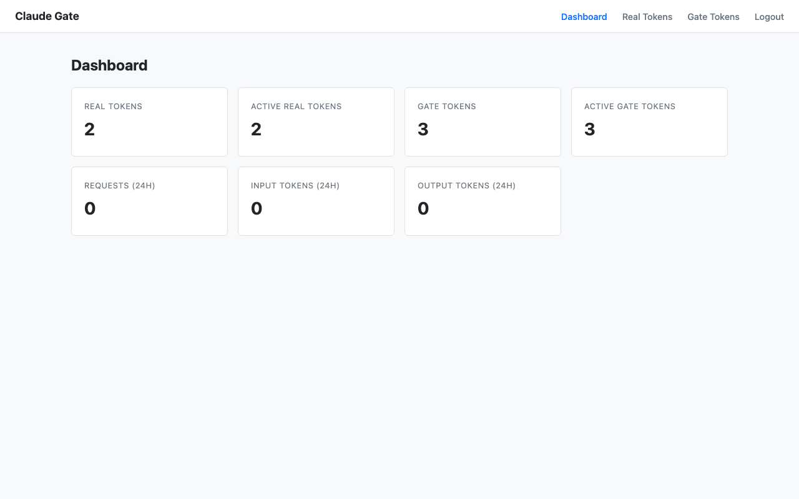
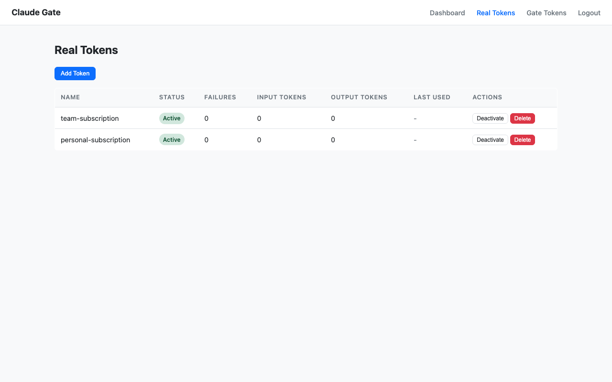
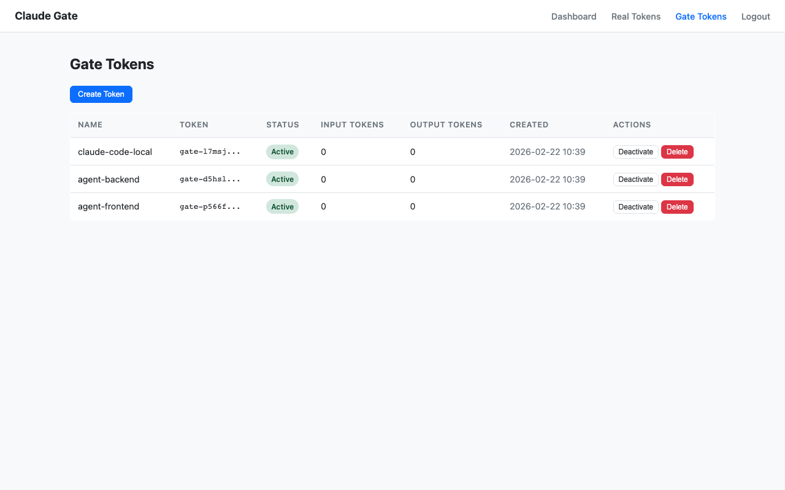
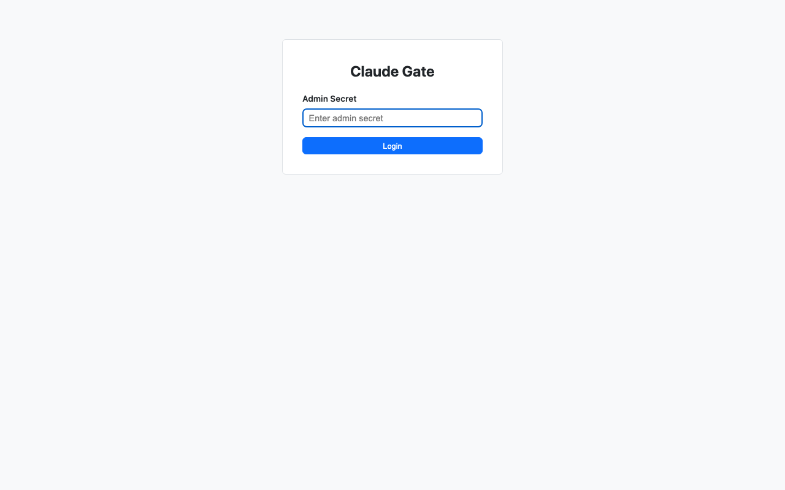

# Claude Gate

Claude API reverse proxy for securely sharing OAuth tokens across multiple Claude Code / Agent SDK instances.

```
Claude Code ──► Claude Gate ──► Claude API
  (gate token)    (swap to real token)    (api.anthropic.com)
```

## Features

- **Token Pool** — Register multiple real OAuth tokens, round-robin load balancing
- **Gate Tokens** — Issue proxy tokens (`gate-xxx`) to clients; real tokens never leave the server
- **Sticky Sessions** — Same gate token routes to the same real token for 10 minutes
- **Usage Tracking** — Per-token input/output token counts parsed from SSE streams
- **Auto-Deactivation** — Real tokens auto-disabled after repeated upstream failures
- **Admin API + Web UI** — Manage tokens and view usage via REST API or browser

## Screenshots

| Dashboard | Real Tokens |
|:-:|:-:|
|  |  |

| Gate Tokens | Login |
|:-:|:-:|
|  |  |

## Quick Start

### 1. Build

```bash
# requires Go 1.26+
make build
```

### 2. Run

```bash
export CLAUDE_GATE_ADMIN_SECRET="your-secret-here"
./bin/claude-gate
```

Server starts on `:8080` by default. Admin UI at `http://localhost:8080/admin/`.

### 3. Register a Real Token

```bash
curl -X POST http://localhost:8080/admin/api/real-tokens \
  -H "Authorization: Bearer your-secret-here" \
  -H "Content-Type: application/json" \
  -d '{"name": "my-subscription", "access_token": "sk-ant-oat01-..."}'
```

### 4. Create a Gate Token

```bash
curl -X POST http://localhost:8080/admin/api/gate-tokens \
  -H "Authorization: Bearer your-secret-here" \
  -H "Content-Type: application/json" \
  -d '{"name": "agent-1"}'
```

Response includes a `gate-xxx` token.

### 5. Use with Claude Code

```bash
ANTHROPIC_BASE_URL="http://localhost:8080" \
CLAUDE_CODE_OAUTH_TOKEN="gate-xxx" \
claude
```

## Configuration

All configuration via environment variables:

| Variable | Default | Description |
|----------|---------|-------------|
| `CLAUDE_GATE_ADMIN_SECRET` | **(required)** | Admin API / Web UI auth secret |
| `CLAUDE_GATE_ADDR` | `:8080` | Listen address |
| `CLAUDE_GATE_DB_PATH` | `./claude-gate.db` | SQLite database path |
| `CLAUDE_GATE_UPSTREAM_URL` | `https://api.anthropic.com` | Claude API upstream |
| `CLAUDE_GATE_STICKY_TTL` | `10m` | Sticky session duration |
| `CLAUDE_GATE_MAX_FAILURES` | `5` | Failures before auto-deactivating a token |
| `LITESTREAM_S3_BUCKET` | *(optional)* | S3 bucket for Litestream replication |
| `AWS_REGION` | *(optional)* | AWS region for Litestream S3 |

## Admin API

All endpoints require `Authorization: Bearer <CLAUDE_GATE_ADMIN_SECRET>`.

### Real Tokens

| Method | Path | Description |
|--------|------|-------------|
| `GET` | `/admin/api/real-tokens` | List all (secrets omitted) |
| `POST` | `/admin/api/real-tokens` | Add token |
| `PUT` | `/admin/api/real-tokens/{id}` | Update |
| `DELETE` | `/admin/api/real-tokens/{id}` | Delete |
| `POST` | `/admin/api/real-tokens/{id}/activate` | Activate |
| `POST` | `/admin/api/real-tokens/{id}/deactivate` | Deactivate |

### Gate Tokens

| Method | Path | Description |
|--------|------|-------------|
| `GET` | `/admin/api/gate-tokens` | List all |
| `POST` | `/admin/api/gate-tokens` | Create |
| `PUT` | `/admin/api/gate-tokens/{id}` | Update |
| `DELETE` | `/admin/api/gate-tokens/{id}` | Delete |
| `POST` | `/admin/api/gate-tokens/{id}/activate` | Activate |
| `POST` | `/admin/api/gate-tokens/{id}/deactivate` | Deactivate |

### Usage

| Method | Path | Description |
|--------|------|-------------|
| `GET` | `/admin/api/usage?since=2024-01-01T00:00:00Z` | Aggregate usage stats |

## Docker

```bash
docker build -t claude-gate .
docker run -e CLAUDE_GATE_ADMIN_SECRET=secret -p 8080:8080 claude-gate
```

### Litestream (SQLite S3 Replication)

For container deployments (ECS, etc.) where local storage is ephemeral, Litestream support is built into the Docker image. Set `LITESTREAM_S3_BUCKET` to activate:

```bash
docker run \
  -e CLAUDE_GATE_ADMIN_SECRET=secret \
  -e LITESTREAM_S3_BUCKET=my-bucket \
  -e AWS_REGION=ap-northeast-2 \
  -p 8080:8080 claude-gate
```

When enabled, the entrypoint will:
1. Restore the SQLite database from S3 on startup (if a backup exists)
2. Run the app while continuously replicating WAL changes to S3

When `LITESTREAM_S3_BUCKET` is not set, the app runs directly without Litestream.

## CI/CD

Automated via GitHub Actions:

- **CI** (`ci.yml`) — Runs on every push/PR to `main`: lint, test, build
- **Release** (`release.yml`) — Runs on push to `main`: auto-tags based on [Conventional Commits](https://www.conventionalcommits.org/) (`feat:` → minor, `fix:` → patch), then builds and pushes Docker image to GHCR

Docker images are available at `ghcr.io/goodgoodjm/claude-gate`.

## Development

```bash
make all        # fmt + vet + lint + test + build
make test       # go test -race ./...
make lint       # golangci-lint run
```

## Tech Stack

- **Go 1.26+** — stdlib `net/http`, `httputil.ReverseProxy`
- **SQLite** — `modernc.org/sqlite` (pure Go, no CGO)
- **HTMX** — Web UI with Go `html/template`

## License

MIT
